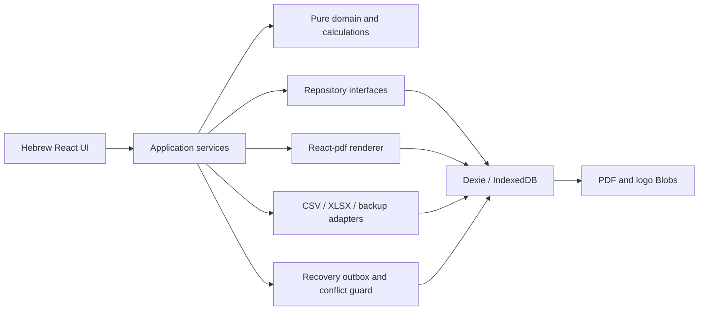

# System architecture

## 1. Decision summary

| Concern | Choice | Reason |
| --- | --- | --- |
| App | Next.js 16 App Router on the vinext/Sites starter, React 19, strict TypeScript | Existing supported starter, local development, private static application delivery |
| Business persistence | IndexedDB via Dexie 4 | Explicitly local-first, transactional, indexed, supports structured records and Blob artifacts |
| Recovery | `dexie-export-import` plus an app-owned versioned `.boqbackup` envelope | Complete portable export including Blobs, staged validation, atomic restore |
| Domain validation | Zod 4 | Runtime validation with TypeScript inference at every untrusted boundary |
| Money | `decimal.js`, canonical decimal strings | Exact decimal arithmetic and explicit rounding modes |
| Tables | Semantic HTML tables; TanStack Table for list screens | Full RTL/keyboard control in editor; typed sorting/filtering in flat lists |
| Reordering | dnd-kit plus move-up/down commands | Pointer, touch, keyboard, and non-drag WCAG alternative |
| PDF | `@react-pdf/renderer` v4, bundled static Noto Sans Hebrew TTF | Client-side Blob generation, RTL style, font embedding, A4 wrapping, fixed content, preview/download |
| CSV/XLSX | Papa Parse and pinned SheetJS CE 0.20.3 | Mature browser parsers/writers; Hebrew BOM and XLSX support |
| Tests | Vitest, React Testing Library, Playwright, axe, PDF.js/Poppler-style renderer checks | Layered domain, integration, E2E, accessibility, RTL, and PDF validation |

Cloud D1/R2 are intentionally not authoritative in v1. Adding them would turn a local single-user product into a cloud-data product and introduce identity/synchronization semantics the brief excludes. IndexedDB is an explicit, documented exception to the platform-storage default. A future packaged desktop build may replace only the repository adapter with SQLite.

## 2. Runtime topology



The application has no server API for business data. The hosted worker serves compiled assets only. Network loss after initial load must not block edits, calculations, revision creation, or downloads.

## 3. Source layout

```text
app/                         routes, layout, error boundaries
src/components/              reusable UI
src/features/                dashboard, projects, editor, catalog, templates, settings
src/domain/                  types, invariants, calculations, cloning, revisions
src/storage/                 Dexie schema, repositories, migrations, locks
src/pdf/                     document model, renderer, font registration, artifact service
src/import-export/           CSV, XLSX, backup, restore staging
src/security/                file signatures, size limits, sanitization helpers
src/testing/                 builders and golden fixtures
public/fonts/                pinned static Hebrew font files and license
tests/                       unit, integration, E2E, RTL, PDF, migration fixtures
.agents/skills/              repo-scoped reusable Codex workflows
docs/                        specifications and decisions
```

Dependencies must point inward: UI/adapters may depend on domain; domain must not import React, Dexie, PDF, or spreadsheet libraries.

## 4. Application routes

- `/` dashboard.
- `/projects` list.
- `/projects/new` template selection and project details.
- `/projects/[id]` editor.
- `/projects/[id]/revisions` history.
- `/projects/[id]/preview/[revisionId]` immutable PDF preview.
- `/templates` manager.
- `/catalog` manager/import/export.
- `/settings` company, units, defaults, storage health, backup/restore.

Route boundaries lazy-load large PDF and spreadsheet code. All IndexedDB access is client-only.

## 5. State and autosave

1. A project editor loads one committed snapshot and acquires a Web Lock named `boq-project:<id>`.
2. Controlled local state becomes dirty synchronously on edit.
3. Text edits enqueue a serialized save after 300 ms idle. Structural edits save immediately after the UI state commits.
4. The repository transaction compares `editVersion`, writes the complete project aggregate, increments the version, and returns the committed timestamp.
5. Only then does the UI display `נשמר`.
6. `BroadcastChannel` notifies other tabs. A conflicting tab becomes read-only and offers reload/duplicate-as-new.
7. `visibilitychange` triggers a flush. `beforeunload` only warns while dirty; it is never the primary save mechanism.

Complete project aggregates are deliberately stored together. This makes autosave atomic, deep copying explicit, and migrations easier. Project list search fields and totals are duplicated into indexed columns and rebuilt from the aggregate when needed.

## 6. Persistence and migrations

- Dexie database name: `aviel-boq`.
- Forward-only schema versions with fixture coverage from every supported version.
- Version-change/blocked handlers show a Hebrew instruction to close the other tab.
- `navigator.storage.persist()` is requested after onboarding; result and `storage.estimate()` are visible in Settings.
- `QuotaExceededError` enters recovery mode and offers immediate project/full backup; the app never deletes revisions or PDFs automatically.
- Database-open/migration failure never calls `deleteDatabase`; it opens a recovery screen.

## 7. Backup and restore

Backup format `boq-backup-v1` contains:

- manifest: format, schema, calculation policies, application version, UTC creation time, record counts, and SHA-256 entries;
- exported database payload including Blobs;
- human-readable summary JSON.

Restore is staged into a temporary database, schema-validated, recalculated, hash-checked, summarized, and committed only after user confirmation. Backups from newer unsupported formats fail closed. Existing data remains untouched until final transaction success.

## 8. Security architecture

- No HTML from project/import content is rendered with `dangerouslySetInnerHTML`.
- Zod validates all imports, backup payloads, restored records, and logo metadata.
- CSV/XLSX/logo limits cover bytes, decoded dimensions, sheet/row/column counts, cell length, and processing time.
- Accept CSV/XLSX and PNG/JPEG/WebP only; reject formulas in required spreadsheet cells and reject SVG logos.
- Generated storage keys and IDs use `crypto.randomUUID`; user filenames are display metadata only.
- Production CSP defaults to self, with the narrow `blob:`/`data:` allowances needed for previews/downloads.
- Exported backups are labeled as containing sensitive business/customer data.
- No third-party runtime scripts or remote font requests.

## 9. Failure model

| Failure | Required response |
| --- | --- |
| Validation | Keep edit in place, mark field, explain in Hebrew, do not commit invalid aggregate |
| Save/quota | Persistent error banner, remain dirty, retry and emergency export |
| Stale tab | Refuse overwrite, read-only conflict screen, reload or duplicate |
| Import | Show row errors; commit nothing until accepted batch is valid |
| Restore | Preserve live DB; provide failure reason and original backup |
| PDF render | Preserve revision snapshot; mark artifact failed/retryable, never attach partial bytes |
| Migration | Recovery mode and backup export; never auto-reset |

## 10. Deployment

`.openai/hosting.json` keeps `d1` and `r2` null. The Sites deployment is owner-only where available. Because IndexedDB is origin-bound, changing scheme/host/port creates a separate data silo; the release checklist requires a backup before changing the deployed origin and a restore test on the target origin.
